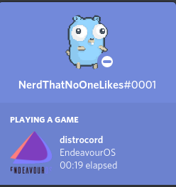

# DistroCord

DistroCord is a tool to show your linux distro info as a discord rich presence

## Installation

```bash
npm i -g distrocord
```
this will install distrocord globally to run it you can do `distrocord` you can also just run 
```bash
npx distrocord
```
## Building From Source
Once you clone this repo make sure you have 

1. NodeJS installed
2. The TypeScript compiler is globally installed

If you have those **cd** into this repository and run **npm i**, after thats over run **npm start** and your rich presence should work

*Note: Not all distros are supported currently*

## Gallery
